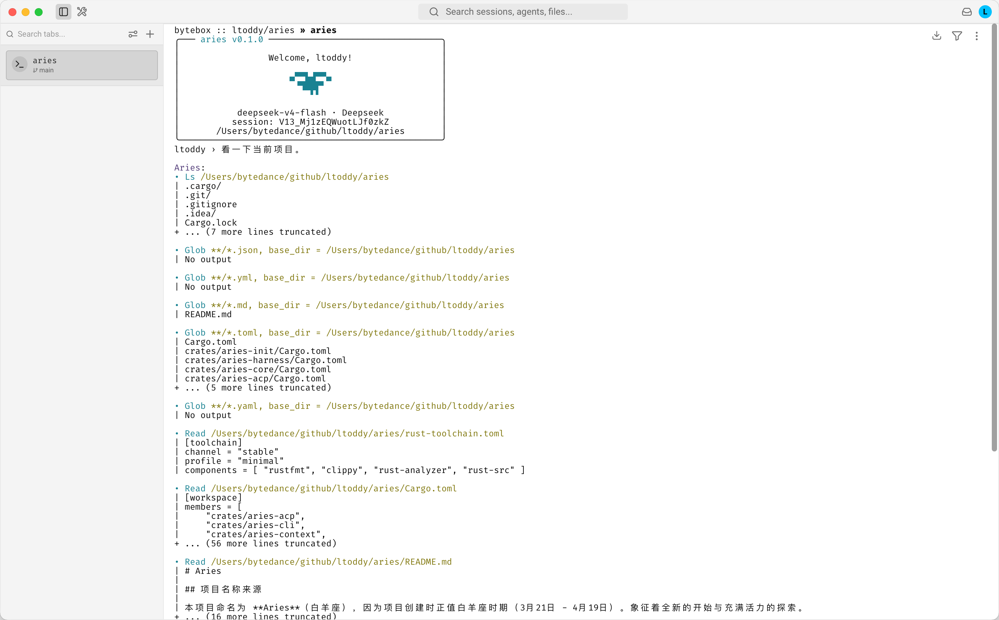

# Aries

## 项目名称来源

本项目命名为 **Aries**（白羊座），因为项目创建时正值白羊座时期（3月21日 - 4月19日）。象征着全新的开始与充满活力的探索。

## MSRV

本项目最低支持的 Rust 版本（MSRV）为 **1.85.0**（Rust 2024 edition）。

## 安装

目前仅支持源码安装，还未发布到 crates.io 上。

安装命令, 如果有 just 命令的情况下可以通过:

> just installl

如果没有 just 命令，可以通过:

> cargo install --path crates/aries-cli --locked

## 使用

### 首次使用:

执行: `aries setup`

后续增加或者删除模型, 使用 `aries model add`, `aries model rm` 命令。

切换模型使用: `aries model default`。

查看当前所有模型: `aries model list`.

## 在支持 Agent Client Protocol 的 IDE 中使用

> 详见 [docs/acp.md](docs/acp.md)

## Aries Island（macOS 菜单栏助手）

> 详见 [docs/mac-island.md](docs/mac-island.md)

## 评测

评测相关脚本位于 [scripts](scripts/) 目录下，目前包含 SWE-bench 评测等工具。
