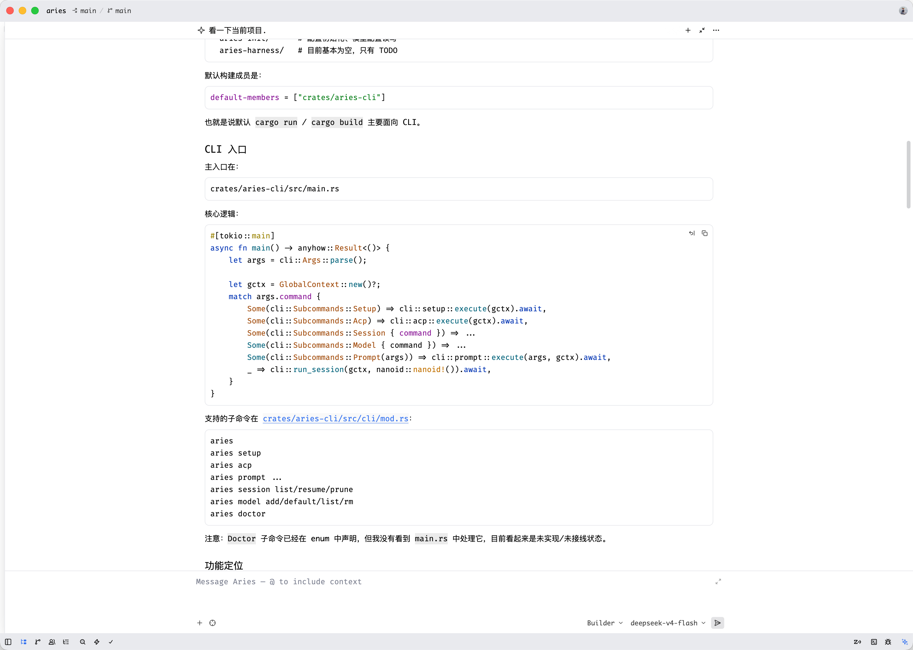

# Aries

## 项目名称来源

本项目命名为 **Aries**（白羊座），因为项目创建时正值白羊座时期（3月21日 - 4月19日）。象征着全新的开始与充满活力的探索。


## 安装

目前仅支持源码安装，还未发布到 crates.io 上。

安装命令, 如果有 just 命令的情况下可以通过:

> just installl

如果没有 just 命令，可以通过:

> cargo install --path crates/aries-cli --locked

## 使用

### 首次使用:

执行: `aries setup`

后续增加或者删除模型, 使用 `aries model add`, `aries model rm` 命令。

切换模型使用: `aries model default`。

查看当前所有模型: `aries model list`.

## 在支持 agent-client-protocol 协议的 IDE 中使用：

### jetbrains IDE


添加配置文件 `~/.jetbrains/acp.json`:

```json
{
  "agent_servers": {
    "aries": {
      "command": "aries",
      "args": [
        "acp"
      ]
    }
  }
}
```

### Zed



在 `~/.config/zed/settings.json` 添加配置:

```json
{
  "agent_servers": {
    "aries": {
      "type": "custom",
      "command": "aries",
      "args": [
        "acp"
      ]
    }
  }
}
```
