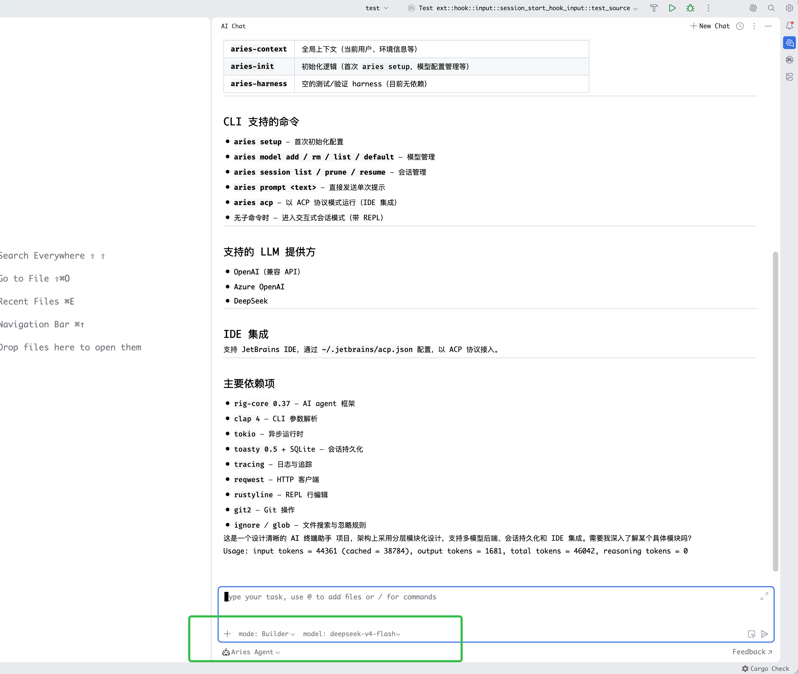

# ACP 服务

## 命令参数

`aries acp` 启动 Agent Client Protocol (ACP) 服务，支持以下参数：

| 参数                      | 说明                                     | 默认值  |
|---------------------------|------------------------------------------|---------|
| `[VERSION]`               | ACP 协议版本：`v1` 或 `v2`               | `v1`    |
| `--bare`                  | 以 bare 模式运行，不加载任何扩展         | 关闭    |
| `--transport <TRANSPORT>` | 服务传输方式：`stdio` 或 `HOST:PORT` | `stdio` |

示例：

```
# 通过 stdio 启动 v1 服务（默认）
aries acp

# 通过 TCP 监听 127.0.0.1:8000
aries acp --transport 127.0.0.1:8000

# v2 协议 + bare 模式
aries acp v2 --bare
```

## 在支持 Agent Client Protocol 的 IDE 中使用

### JetBrains IDE



添加配置文件 `~/.jetbrains/acp.json`:

```json
{
  "agent_servers": {
    "aries": {
      "command": "aries",
      "args": [
        "acp"
      ]
    }
  }
}
```

### Zed


在 `~/.config/zed/settings.json` 添加配置:

```json
{
  "agent_servers": {
    "aries": {
      "type": "custom",
      "command": "aries",
      "args": [
        "acp"
      ]
    }
  }
}
```
