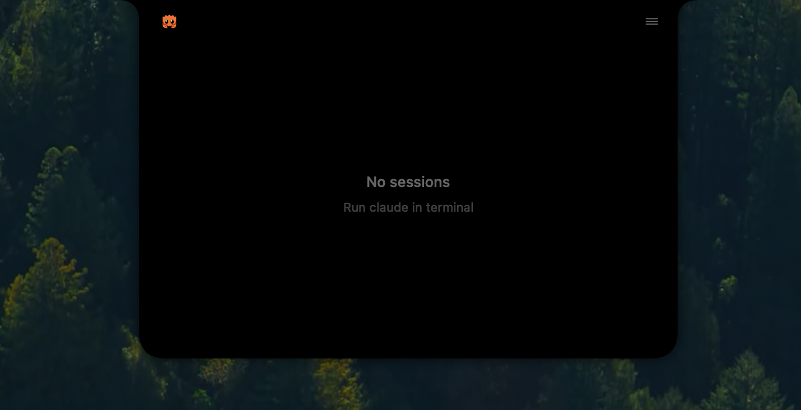
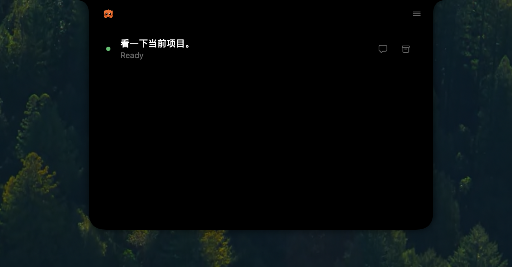
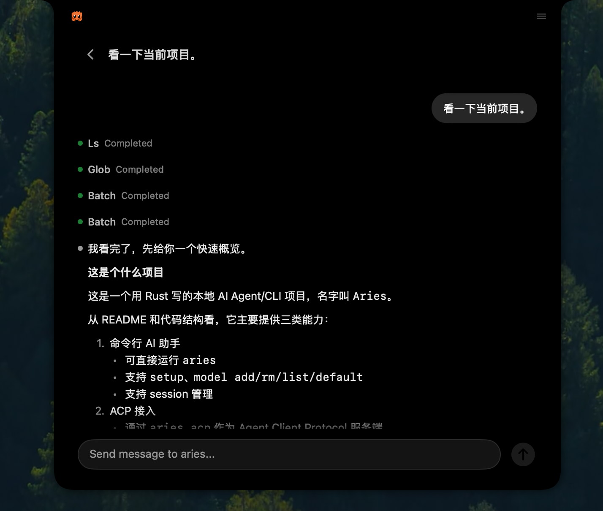

# Aries Island（macOS 菜单栏助手）

Aries Island 是一个 macOS 菜单栏辅助应用，依托 Dynamic Island 形态提供实时会话监控与交互。

## 截图

| 空闲状态                          | 会话列表                                | 对话界面                              |
|-----------------------------------|-----------------------------------------|---------------------------------------|
|  |  |  |

## 功能

- **会话监控**：在菜单栏 notch 区域显示当前会话状态（idle / processing / waitingForInput / compacting / ended）
- **对话交互**：支持在下拉面板中直接发送 prompt，查看完整的对话历史与工具调用结果
- **工具调用追踪**：可视化展示 Read、Edit、Bash、Grep、WebFetch 等工具的执行状态与输出
- **通知提醒**：当会话等待用户输入时触发 notification，可自定义提示音
- **多会话管理**：列表展示所有活跃会话，按项目分组，支持归档

## 构建与运行

```bash
cd mac-extensions/island
make run # 运行（开发模式）
make install # 安装
make uninstall # 卸载
```

首次运行 App 后，hook 配置会自动写入 `~/.agents/hooks/aries-island/hooks.json`，后续 aries CLI 进程启动时即会通过 Unix
socket 将事件推送到 Island。无需额外配置。
